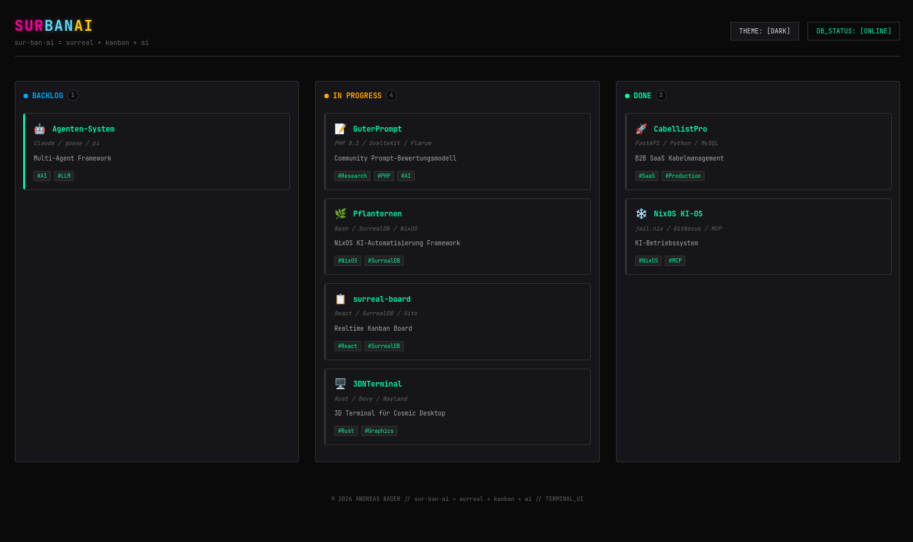
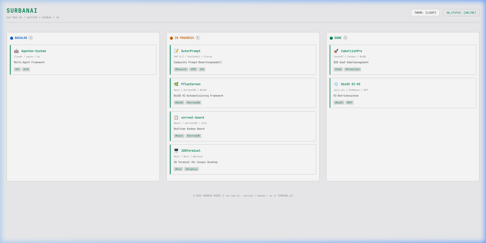

# SurKAi

> **sur·ban·ai** = **sur**real + kan**ban** + **ai**
>
> Zero-backend realtime Kanban board powered by SurrealDB WebSocket

---

## Screenshots

| Dark Theme | Light Theme |
|---|---|
|  |  |

---

## Features

- **Realtime** — SurrealDB LIVE SELECT for instant sync across all clients
- **Zero Backend** — Browser connects directly to SurrealDB via WebSocket
- **Dark/Light Theme** — Terminal hacker dark + clean light mode with localStorage persistence
- **Drag & Drop** — Move cards between columns via native HTML5 API
- **Detail Panel** — Click any card to edit inline, copy START/STOP commands to clipboard
- **NixOS Compatible** — Works with declarative NixOS environments
- **.project.toml Sync** — Auto-sync projects from config files to SurrealDB

---

## Quick Start

Works on any Linux, macOS, or Windows WSL2.

1. Install SurrealDB:
   curl -sSf https://install.surrealdb.com | sh

2. Clone and run:
   git clone https://github.com/diebugger-tech/SurKAi
   cd SurKAi
   cp .env.example .env
   npm install
   surreal start --bind 127.0.0.1:8000 --user root --pass root surrealkv://./data &
   npm run dev

3. Open http://localhost:5174

Edit .env:
VITE_SURREAL_URL=ws://127.0.0.1:8000/rpc
VITE_SURREAL_USER=root
VITE_SURREAL_PASS=root
VITE_SURREAL_NS=kanban
VITE_SURREAL_DB=projects

NixOS: nix-shell -p surrealdb nodejs

---

## Makefile

make help       Show available commands
make dev        Start development server (port 5174)
make stop       Stop dev server
make db-start   Start SurrealDB locally
make db-init    Initialize demo data
make status     Show service status

---

## Architecture

Browser (React) -> WebSocket -> SurrealDB -> LIVE SELECT (realtime push)

No Express. No FastAPI. No proxy. SurrealDB IS the backend.

---

## Database Management

Surrealist (official GUI): https://surrealist.app

---

## Integrations (coming soon)

- Obsidian — sync #todo tags from vault notes to board cards
- Hermes — bidirectional AI agent task sync
- Pflanternen — NixOS automation diagnostics as cards

---

## Contributing

Contributions welcome! See CONTRIBUTING.md
Open an issue: https://github.com/diebugger-tech/SurKAi/issues

---

## License

MIT © Andreas Bader 2026
